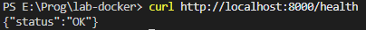

# Лабораторная работа: Контейнеризация приложений с использованием Docker

## Цель работы
Научиться создавать Docker-образы, описывать многокомпонентные системы с помощью Docker Compose, обеспечивать воспроизводимость и изоляцию программных окружений, применять health checks и управление данными (volumes).

## Архитектура проекта
Проект состоит из двух сервисов:
1. **Backend** — веб-приложение на FastAPI (Python), предоставляющее endpoint `/health`.
2. **Database** — СУБД PostgreSQL 15, используемая для хранения данных.

## Обоснование
Для бэкенда: python:3.11-slim — минимальный образ с необходимыми инструментами, уменьшает размер итогового образа.
Для базы данных: postgres:15-alpine — легковесный образ на Alpine Linux, обеспечивает быструю загрузку и экономию дискового пространства.

## Обеспечение безопасности
В Dockerfile бэкенда создается непривилегированный пользователь appuser, от которого запускается приложение. Это снижает риски при компрометации контейнера.

Сервисы запускаются в отдельных контейнерах, связанных через Docker-сеть `app-network`. Бэкенд подключается к базе данных по хосту `db`.

## Инструкция по запуску
    **Клонирование репозитория и переход в директорию проекта:**
    Bash
    git clone *репозиторий
    cd lab-docker

## Скриншоты

### 1. Статус сервисов после запуска

### 2. Проверка эндпоинта /health

## Развертывание
### Git
    bash
git clone https://github.com/qxKnight/lab-docker.git
cd lab-docker
docker-compose up --build -d

## Сборка, запуск и тестирование

**Запуск**
docker-compose up --build -d

**Статус сервисов**
docker-compose ps

**Эндпоинт бэкенда**
curl http://localhost:8000/health

**Логи бэкенда - наличие ошибок подключения к БД**
docker-compose logs backend

**Логи БД**
docker-compose logs db

**Останов**
docker-compose down -v